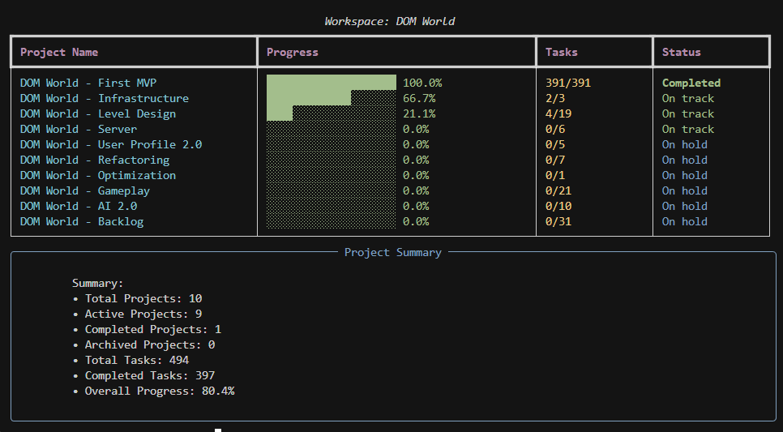

# Asana Project Progress Tracker - CLI Version

A Python script that displays progress bars for all your Asana projects in the console, showing completion percentage based on completed vs total tasks.



## Features

- 🔍 Fetches all projects from all workspaces
- 📊 Displays separate tables for each workspace
- 📈 Shows progress bars with completion percentages
- 📋 Displays task counts (completed/total)
- 🏷️ Shows actual Asana project status ("on track", "at risk", "on hold", etc.)
- 🔐 Secure API key storage using system keychain
- 📈 Provides summary statistics
- 🎨 Beautiful console output with colors and formatting

## Setup

### 1. Install Dependencies

```bash
pip install -r requirements.txt
```

### 2. Get Your Asana API Key

1. Go to [Asana Developer Console](https://app.asana.com/0/developer-console)
2. Create a new app or use an existing one
3. Copy your Personal Access Token

### 3. API Key Storage

The script will automatically prompt you for your API key on first run and store it securely in your system's keychain. You won't need to enter it again on subsequent runs.

## Usage

Run the script:
```bash
python asana_progress.py
```

On first run, you'll be prompted to enter your Asana API key. It will be stored securely in your system keychain for future use.

## Output

The script will display:
- Separate tables for each workspace showing:
  - Project name
  - Visual progress bar with percentage
  - Task count (completed/total)
  - Actual Asana project status
- Summary statistics including:
  - Total projects
  - Active/Completed/Archived projects
  - Overall progress across all projects

## Example Output

```
┌────────────────────────────────────────────────────────────────────────────────────┐
│                           Workspace: Marketing                                     │
├─────────────────────────────────────┬─────────────────────────────┬──────┬─────────┤
│ Project Name                        │ Progress                    │ Tasks│ Status  │
├─────────────────────────────────────┼─────────────────────────────┼──────┼─────────┤
│ Website Redesign                    │ ████████████████████ 100.0% │ 15/15│ on track│
│ Content Creation                    │ ██████░░░░░░░░░░░░░░ 30.0%  │ 3/10 │ on hold │
└─────────────────────────────────────┴─────────────────────────────┴──────┴─────────┘

┌────────────────────────────────────────────────────────────────────────────────────┐
│                         Workspace: Engineering                                     │
├─────────────────────────────────────┬─────────────────────────────┬──────┬─────────┤
│ Project Name                        │ Progress                    │ Tasks│ Status  │
├─────────────────────────────────────┼─────────────────────────────┼──────┼─────────┤
│ Mobile App Development              │ ████████████░░░░░░░░ 60.0%  │ 12/20│ at risk │
└─────────────────────────────────────┴─────────────────────────────┴──────┴─────────┘
```

## Requirements

- Python 3.7+
- Asana API access
- Required packages: `asana`, `tqdm`, `rich`, `keyring`

## Troubleshooting

- **API Key Error**: Make sure your Asana API key is valid and has the necessary permissions
- **No Projects Found**: Check that you have access to projects in your Asana workspaces
- **Connection Issues**: Verify your internet connection and Asana API status
- **Keychain Issues**: If keychain storage fails, the script will still work but you'll need to enter the API key each time 